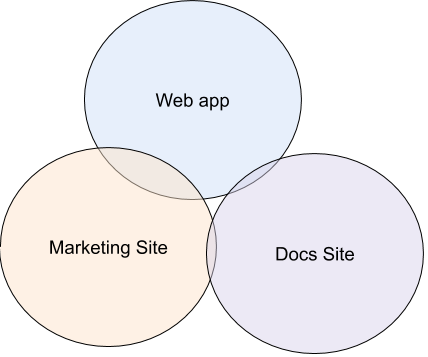

# virnect-storybook-bit-test

## 목표

- Page기반 → UI 컴포넌트 기반으로 전환 과정에서 개발 & 디자인 Work flow 개선

    

    - 개발 : 공통 디자인 컴포넌트 관리, UI 컴포넌트 명세서

    

    - 디자인 : 실제 웹 상에서의 시각 테스트(Storybook)

---

## Stroybook

- 시연 - [https://seunghyum.github.io/VirnectStorybookTest/?path=/story/*](https://seunghyum.github.io/VirnectStorybookTest/?path=/story/*)
- 설명
    - [Ant](https://ant.design/docs/react/introduce), [materialize](https://material.io/components/) 같은 사이트처럼 문서 기능(to 개발)
    - 회귀 테스트 가능(디바이스 크기별 체크가능 / 중국어, 영어등 외국어 일경우 UI 변화도 체크가능)

---

## 도입 장점

🐱‍👤 디자인 / 개발 파트의 효용성을 계속 생각하며 고도화해야 함.

- 웹에 최적화된 비쥬얼 테스트(모바일, 태블릿, 데스크탑 화면 조정 가능)
    - 함께 쓰면 좋은 크롬 : chrome toogle device topbar, stylebot, colorpick eyeDroper
- 디자인적인 효용성
    - 실제 웹에선 어떻게 나오는지를 확인할 수 있음. → 하지만 실제 구현 페이지에서는 다르게 보일 수 있음. 결국은 실제 서비스 페이지에서 확인해야함.
    - 해당 UI를 마음대로 값을 조정하여 변수들을 체크해볼 수 있음.
    - 국제화 표준값을 변경해보며 UI 확인이 가능.
- 개발적인 효용성
    - UI 코드 명세서(어떻게 생겼고 어떻게 사용해야하는지)
    - 단위 테스트에 적합(인터렉티브한 UI에 한해서만 해야함.)

---

## 위험성

- ***디자인 파트***
    - 제플린같은 디자인 툴을 사용하는 편이 더 나을 때가 많음. 실제 웹에서 어떻게 구현되는가를 컴포넌트별로 체크할때만 효용성이 있음.
- ***개발 파트***
    - 오버 엔지니어링 : 단위테스트가 필요없을 정도로 마이너한 일들은 명세서의 역할만 할 정도로 개발.
    - 개발기한 → 지금은 UI 컴포넌트 개발과 프론트앤드 기능개발을 병렬적으로 해야함.
    - 아래의 그림처럼 다른 사이트들에서 막상 공유되는것이 없을 경우

---

---

## 계획

- 개발 구성원들이 다 바빠서 실제 활용은 내년 예상.
- 일단 구조부터 만들기. - 승현
- [virnect.github.io](http://virnect.github.io) 에 Storybook 배포하기 - [예시](https://seunghyum.github.io/VirnectStorybookTest/?path=/story/alerts--default)
- 디자인에 맞춰서 도입이 필요 없을 경우엔 Skip.