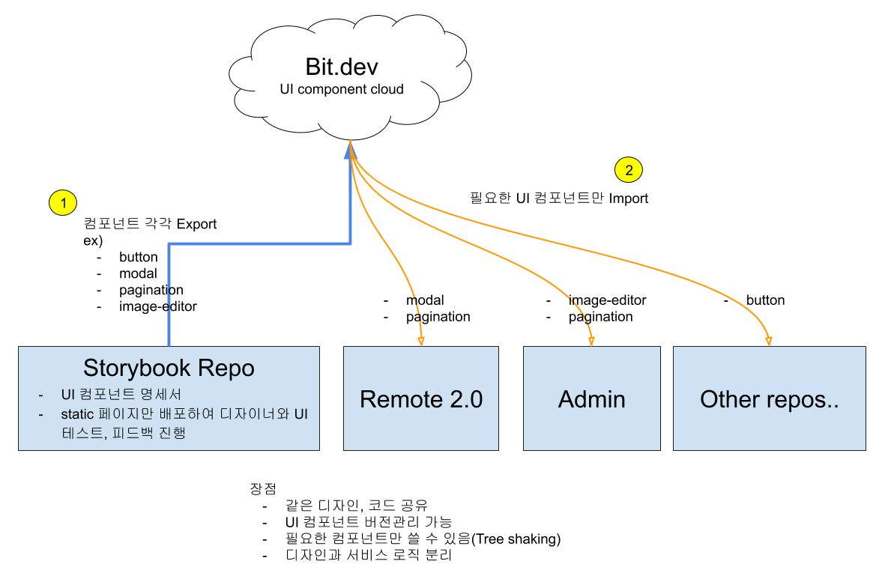

# virnect-storybook-bit-test

## 시연해볼 구조



## Setting & Start

```
$ yarn
$ yarn storybook
```

## Work Flow 시연

- 참고 : [Bit Quick Start](https://docs.bit.dev/docs/quick-start)
- 대상 Bit 레포 [주소](https://bit.dev/seunghyum/virnect-test)
- Bit 계정에 로그인하지 않고 CLI만 설치하면 가져다 쓸 수 있음. Bit으로 Export 만 로그인 필요.

### 1. Export to Bit

- 컬렉션이 없을 경우 하나 만들어야함.

1. 로그인
2. Storybook 레포지토리(여기)에서 Bit cloud로 export할 대상 컴포넌트를 아래의 명령어로 추가
   - 추가시 파일내에서 Import한 것들도 추가해주어야함.
    ```
    $ bit add <Bit에 추가할 대상 컴포넌트 path> --id <컴포넌트 이름 설정>

    // 예시
    $ bit add ./src/components/Button/Button.vue --id virnect-button
    $ bit add src/utils/color.js
    ```

3. 태그 입력 
```
  $ bit tag --all 1.0.0
```
4. 상태 확인
```
  $ bit status
```
5. 푸시
```
  $ bit export <유저명>.<컬렉션 이름>

  // 예시
  $ bit export seunghyum.virnect-test
```

### 2. import from Bit

```
  $ bit import <유저명>.<컬렉션명>/<컴포넌트 이름>

  // 예시
  $ bit import seunghyum.virnect-test/virnect-button
```
## 참고

UI 컴포넌트 참고 사이트 : https://bit.dev/lusaxweb


